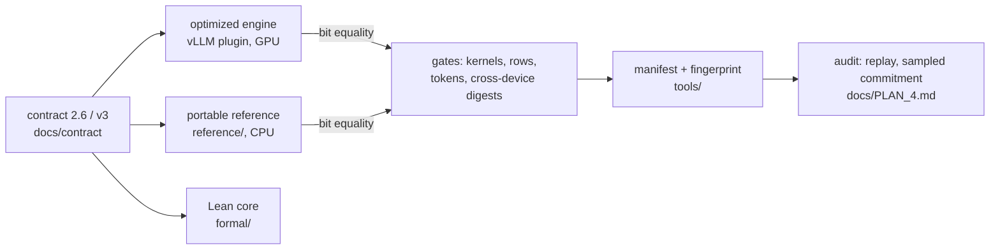

# Lockstep

**Bit-exact, verifiable transformer inference at stock speed, across devices.**

[](https://github.com/ptoggle/lockstep/actions/workflows/verify.yml)
[](https://github.com/ptoggle/lockstep/releases)
[](https://doi.org/10.5281/zenodo.22695303)
[](LICENSE)
[](paper/main.pdf)
[](docs/contract/)
[](formal/)

A production serving engine and a portable CPU reference return the **same bits** because they
implement the same published function. Lockstep is a versioned arithmetic *contract* for the
whole decoder: bounded integer arithmetic where the work is, immutable lookup tables for the
nonlinearities, and a small ordered set of explicitly rounded binary32 operations where finite
precision cannot be avoided. Verification is bit equality against a public definition, not a
tolerance and not a re-run of the provider's environment.

This repository is the **public specification set**: the contracts, the CPU-capable references,
the Lean formalisation of the contract core, the conformance kits with their digests, the raw
measured evidence, and the paper. The optimized GPU implementation (a vLLM plugin with a modified
FlashAttention-3 prompt kernel, a split-KV decode kernel and fused dense and mixture-of-experts
kernels) is a separate codebase; every claim about it is backed here by a gate count, a result
file or a digest.

> Version 0.2.0, September 2026. Glavas, Yakovenko, Allen.

## At a glance

**Speed against stock vLLM 0.25.1** (same H100, same session, one process per stack; ratios above
1 are faster; TTFT ratios invert latency so above 1 is faster too).

| model | decode tok/s, batch 1 / 8 / 32 | time to first token, 2K / 8K | served, 64 concurrent | quality vs stock |
|---|---|---|---|---|
| Qwen2.5-7B | 1.14 / 1.10 / 1.01 | 1.03 / 1.06 | 0.87 chat, 0.97 mixed, 0.97 prefill-heavy | +0.27 % ppl |
| Llama-3.1-8B | 1.10 / 1.05 / 1.01 | 1.04 / 1.08 | | +0.22 % |
| Mistral-7B | 1.13 / 1.09 / 1.04 | 1.05 / 1.07 | | +0.09 % |
| Phi-4-mini (2.6) | 1.23 / 1.21 / 1.13 | 1.07 (2K) | | +0.61 % |
| Qwen3-8B (2.6) | 1.18 / 1.13 / 1.04 | 1.10 / 1.13 | | −0.39 % |
| Qwen3-30B-A3B, mixture of experts | 0.87 / 1.04 / 1.26 | 0.86 / 0.88 | **1.32–1.37** | +0.12 % |
| GPT-OSS-20B on its own MXFP4 weights, exact | 0.62 / 0.33 / 0.32 | 0.31 / 0.32 | 0.52–0.54 | **−2.06 %** (better than stock's MXFP4 path) |
| Qwen2.5-72B, tensor-parallel 4 | | | 0.91 / 0.98 / 0.98 | +0.14 % |

**Exactness.** Every gate is bit equality and every count below is a zero-difference result:
1,186 fused-kernel cases on captured real activations; 151,200 prompt rows and 29,736 generated
rows replayed from the live engine; 263 mixture-of-experts cases; 43 + 10 decode-kernel cases with
sink on and off; token identity across batch compositions, CUDA-graph modes and tensor
parallelism; 36 contract vectors; the Lean bridge artifact with its mutation test.

**Across devices.** 538 output digests of the cross-architecture kit are identical on H100
(sm_90, torch 2.11 / CUDA 13.0), RTX 4090 (sm_89, torch 2.4 / CUDA 12.4) and RTX 5090 (sm_120,
torch 2.8 / CUDA 12.8); the norm reference reproduces on x86 and Apple silicon CPUs, 72 / 72.

Every number above has a row in [`docs/EVIDENCE.md`](docs/EVIDENCE.md) naming its gate, result
file, theorem or dated log; the open items that bound the claims are its section 7 and are
filed as [issues](https://github.com/ptoggle/lockstep/issues). Full tables and methodology:
[`paper/main.pdf`](paper/main.pdf), sections 10 and 11.

## Evidence hashes

Fixed values that a verifier can compare against without trusting this README.

| artifact | value |
|---|---|
| LSSA-B8 exponential table `T2` (2,176-byte CSV, SHA-256) | `7a42a785940f557d5d5a4188fa5683ea00cf8b29e8d5213c75c581a5a0d92fbb` |
| cross-architecture kit: kernel outputs, all 538 (H100 = RTX 4090 = RTX 5090) | `aea3318f27bc7b043ebc0d66…` |
| cross-architecture kit: reference outputs, all 538 | `6a26383d7dc83bbf23ae6b18…` |
| cross-architecture kit: shipped inputs `inputs.npz` (430 arrays, SHA-256 prefix) | `af8935225283df14` |
| `conformance/contract_vectors.json` (36 vectors, SHA-256 prefix) | `00d7459086d6a2c9` |
| `conformance/lean_contract_artifacts.json` (SHA-256 prefix) | `bb5c38c9a9daa55e` |
| `conformance/xarch26/digests_h100merge.json` / `_ada_rerun` / `_blackwell_rerun` | `4049bbeca2e3673b` / `4b3163c66175408a` / `522e9e4cd100038e` |
| `conformance/xarch26/norm_inputs.npz` (the 108 norm arrays, SHA-256 prefix) | `f436e3750a79e26c` |

The release page carries `SHA256SUMS` over the source archive, the paper PDF and the files above; the same files are archived at Zenodo under DOI [10.5281/zenodo.22695303](https://doi.org/10.5281/zenodo.22695303).
Full digests per case are inside the digest files; `python conformance/xarch26/compare.py` prints
the comparison.

## Verify on a CPU

```bash
pip install numpy torch     # CPU builds are enough; elan for Lean (https://leanprover.github.io)
make verify
```

| step | what it checks |
|---|---|
| `make selftest` | the attention goldens (python integers and numpy) against the torch references, 239 + 28/119 + 228 cases, including the negative controls that must differ; the exact MXFP4 dequant |
| `make vectors` | the 36 contract vectors |
| `make lean` | the Lean build, the formal checker, the exported artifact against the Python bridge, and the mutation test that must reject a changed digest |
| `make cpu-norm` | the float norm's numpy twin against the H100 reference digests, 72 cases |

About ten minutes on a laptop; one PASS line per check. A differing bit anywhere is a defect:
see [`SECURITY.md`](SECURITY.md).

**A served endpoint:** `python tools/lockstep_selftest.py <manifest-dir> --url http://host:8000`
replays the manifest's 256-token probe and compares every prompt log-probability bit pattern and
eight greedy token ids. **A manifest's constants:** `python tools/verify_constants.py` recomputes
every folded constant from the public checkpoint and compares digests.

## Why

A public checkpoint is not yet a public computation. Kernels, reduction trees, batch composition,
compilers and devices all legitimately change the low bits, so an auditor today must reproduce
the provider's exact environment or accept a tolerance. Batch-invariant engines hold only within
one GPU family; hardware emulators are rebuilt for every architecture; and a one-bfloat16-spacing
tolerance is blind to an entire class of epilogue faults. Lockstep moves the boundary: the served
function itself is canonical, and it is designed together with the kernels so that the production
path stays at stock speed.



## How it works

**Attention (LSSA-B8).** Keys are partitioned into fixed 128-key blocks; queries, keys and values
are quantized onto power-of-two int8 lattices; every score is an exact int32 dot product; the
weight is an 8-bit table value indexed by the integer distance to the block maximum; the weighted
value sum is exact inside the block; block states are folded in ascending order through a
two-level binary32 recurrence with explicit roundings. Tiling is free where the arithmetic is
associative and fixed where it is not. Two KV-cache variants (B9.1, B9.3) keep the fold.
[`docs/contract/BLOCK_EXPONENT_VARIANT.md`](docs/contract/BLOCK_EXPONENT_VARIANT.md)

**Dense decoder (contract 2.6).** Int8 linears with a declared epilogue and an outlier side path;
a float RMSNorm whose reduction order is pinned by element index and whose reciprocal square root
is one IEEE square root and one IEEE division (the 2.5 integer norm stays selectable); fixed-Q14
rotary embeddings; a table SiLU; a two-plane language-model head; basis rotations; a rank-ordered
tensor-parallel reduction. [`docs/contract/NON_ATTENTION_STACK_v2.6.md`](docs/contract/NON_ATTENTION_STACK_v2.6.md)

**Mixture of experts (contract v3).** An int8 gate, a table router with a lowest-index tie rule,
bf16 routing weights, int8 experts under the dense contract, an ascending-index combine; an
addendum for GPT-OSS's biased clamped SwiGLU; and a rule that consumes MXFP4 expert weights
exactly, one exact int32 partial and one rounded binary32 update per 32-wide block.
[`docs/SPEC.md` §7.27](docs/SPEC.md)

**Evidence.** A scalar golden implements the text; torch references vectorize it; standalone
kernels are gated against the references with negative controls that must differ; the live
engine's rows and tokens are replayed; a manifest binds the constants and a fingerprint binds a
deployment; a cross-architecture kit fixes inputs and hashes every output. The oracle is never
widened to make a gate pass. [`docs/EVIDENCE.md`](docs/EVIDENCE.md)

**Formal core.** Twenty Lean 4.33.1 modules, no admitted theorem: an executable bit-level
binary32 and bfloat16 model, the integer bounds, the ordered fold's determinism and its legal
schedule refinements, sound admission, transcript and audit checkers, bridged to an independent
Python verifier. What it does not prove is stated just as precisely.
[`docs/LEAN_PROOF_SCOPE.md`](docs/LEAN_PROOF_SCOPE.md)

## Layout

```
docs/contract/     normative contracts: attention (LSSA-B, B8, B9.x), dense 2.5 / 2.6
docs/SPEC.md       the research record; §7.27 is the MoE contract v3 with the MXFP4 rule
docs/EVIDENCE.md   every claim -> its artifact       docs/PLAN_4.md  the semantics programme
docs/PLAN_*.md     dated measurement logs (dense: 21, 24; mixture of experts: 3)
reference/         CPU references: attention goldens and torch twins, dense operators, the float
                   norm with its numpy twin, MoE, exact MXFP4 dequant, the head variants
formal/            the Lean development
conformance/       contract vectors, the cross-architecture kit and digests, the Lean bridge artifact
tools/             manifest schema and hashing, constants verifier, endpoint selftest, row replay
results/           raw result files of every measured row (s2: dense, s3: mixture of experts)
paper/             the manuscript and its PDF
```

## Roadmap

[`docs/PLAN_4.md`](docs/PLAN_4.md), tracked as issues: an executable interpreter that *is* the
specification for dense and MoE models, gated token-identical to the engine; a signed semantic
root and a claim format a third party verifies without the operator; conformance packs generated
from a dependency-free reference; fault-injection evidence; the Lean development extended to the
2.6 norm and the MoE contract; GPT-OSS attention brought onto the contract.

## Paper, citation, licences

*Lockstep: Bit-Exact, Verifiable Transformer Inference at Parity Across Devices, for Dense and
Mixture-of-Experts Models*, Perica Glavas, Maksym Yakovenko, Logan Allen, September 2026:
[`paper/main.pdf`](paper/main.pdf). Cite with [`CITATION.cff`](CITATION.cff).

Code: [Apache-2.0](LICENSE). Paper: CC BY 4.0. Vectors, digests and results: CC0. See
[`NOTICE`](NOTICE). Contributions carry a Developer Certificate of Origin sign-off and follow the
gate rule in [`CONTRIBUTING.md`](CONTRIBUTING.md); digests from new devices are welcome by pull
request ([`CONFORMANCE.md`](CONFORMANCE.md)).
